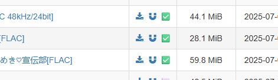
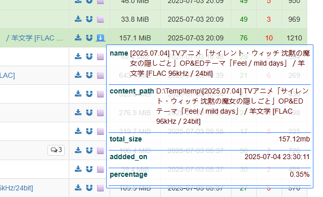
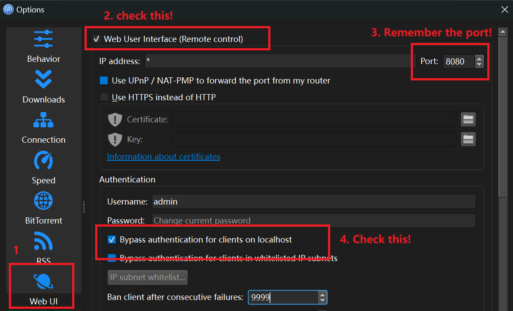
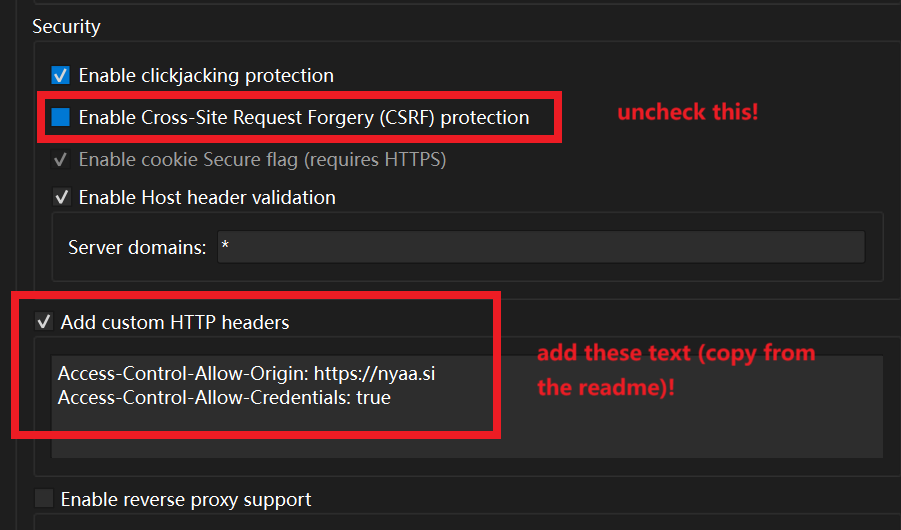
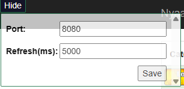

# Description

## Brief

an easy chrome extension to watch torrents(magnet link) download condition on <https://nyaa.si/>, to much easier to know which torrent(magnet link) you downloaded.

the icon next to the magnet link will show the condition of this link:



if you click the icon, it will show more information about the file



## Install

To install the chrome extension, download the `dist___.zip` from releases.
And then go to the extension url <chrome://extensions/>, and then drag the zip to the page.

## Setup

1. To use the chrome Extesion, need to setup the config in QBittorrent in `Tool - Options`, and then open the WebUI tab and follow the steps below:

    

2. scroll down, and follow the step below:

    

    the headers of security:

    ```text
    Access-Control-Allow-Origin: https://nyaa.si
    Access-Control-Allow-Credentials: true
    ```

3. and then open the <https://nyaa.si/> in Chrome, fill the port above (default: 8080)

    

OK!

## config

- `Refresh(ms)` the extension will update all the torrents condition by request the API. The parameter should not be too small, or the QBittorrent client will be freezed when you want to create a new task.

## Dev

```shell
pnpm install
pnpm watch
```

And then install the unpacked in Chrome.